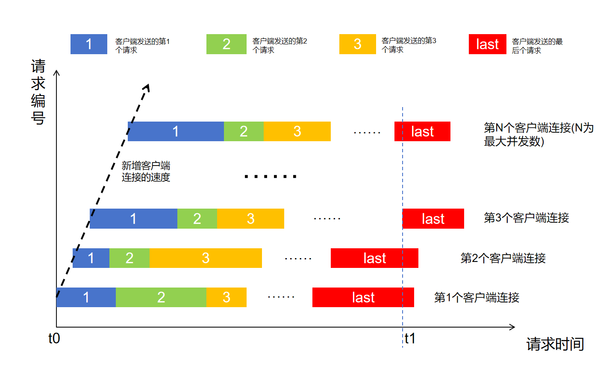
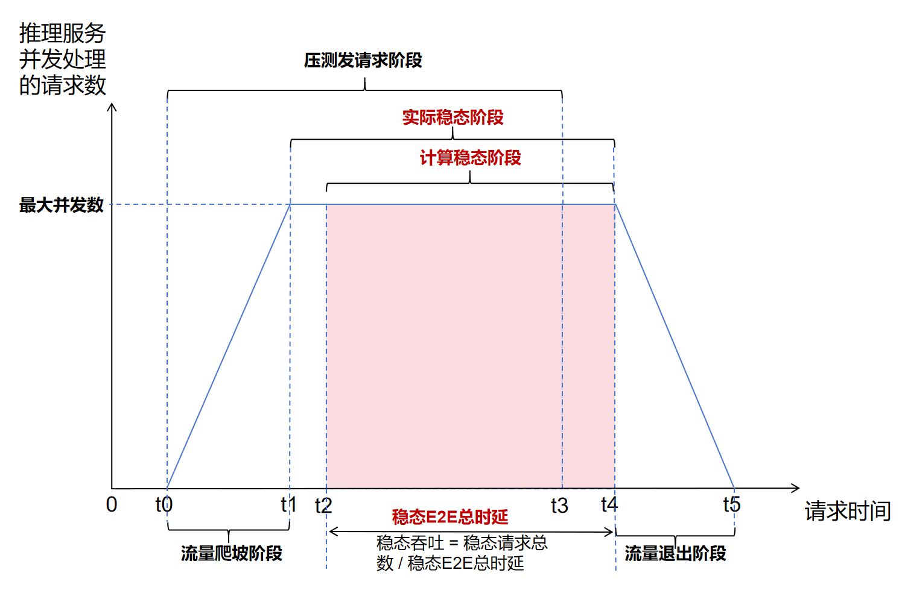

# 服务化性能压力测试

## 概念介绍
AISBench的服务化性能压力测试是为了模拟真实推理服务的业务场景，测试推理服务处于稳定状态下的性能。**稳定状态**，是指推理服务在并发请求数量达到最大值时，能够同时处理且保持稳定的状态。
### 性能压力测试过程原理
AISBench的性能压力测试的过程是在模拟多个客户端连续不断发送请求，通过不断增加客户端的数量来增加测试压力，最终客户端的数量达到最大并发数，推理服务就正式进入稳定状态(如下图所示)。整个压力测试过程持续固定时间，确保稳定状态能持续一定时间。


### 稳定阶段性能数据计算方式说明
**AISBench计算的稳定阶段性能数据，本质上是来源于处于该阶段所有请求**。<br>
当推理服务同时在处理的请求数量达到最大并发数时，可以认为系统处于稳定阶段，推理服务同时在处理的请求数量随测试时间的变化图理想状态如下：


- **流量爬坡阶段:** 与推理服务建立连接的客户端数量在不断增加，服务同时处理的请求数也同步增加。
- **实际稳态阶段:** 推理服务同时在处理的请求数量达到最大并发数。
- **计算稳态阶段:** 推理服务同时在处理的请求数量首次达到最大并发数后的第一条请求发送的时间点(t2)至推理服务同时在处理的请求数量最后处于最大并发数(t4)的阶段。工具将开始时间处于这个阶段的所有请求都视为稳定阶段的请求。<br>性能指标中的Benchmark Duration指的就是这个阶段的时延。<br> **注意**，由于Benchmark Duration会用于计算吞吐率，计算出的吞吐率会存在误差，误差是由于t0至t2之间未算入稳态的请求和t4至t5中被纳入稳态阶段的请求占用的计算资源差异导致的。只有当整个测试过程的最大的单请求时延E2EL(End-to-End-Latency)小于Benchmark Duration的1/3时，计算出的吞吐数据置信度才足够。
- **压测发请求阶段:** 此阶段工具在不断给推理服务发送请求，此阶段后工具会等待所有请求返回。
- **流量退出阶段:** 推理服务同时处理的请求数量在不断降低，直到最终所有请求都返回。

## 使用AISBench对推理服务进行压力测试
本章节以“命令行界面CLI指定模型和数据集”的方式运行工具为例。
首先需要确保可在测试环境直接访问模型的推理服务进程，例如[vLLM](https://github.com/vllm-project/vllm)、[TensorRT-LLM](https://github.com/NVIDIA/TensorRT-LLM)、MINDIE。本章节将以支持endpoint为v1/chat/completions的openai chat的流式接口的推理服务为例。

### 主要功能
- [执行压力测试得到稳态性能数据](#执行压力测试得到稳态性能数据): 通过压力测试的方式得到过程中每个请求的性能数据，并计算出稳定阶段的汇总性能数据。
- [重计算稳态性能数据](#重计算稳态性能数据)：复用上次压力测试的每个请求的性能数据，计算出稳定阶段的汇总性能数据。

### 执行压力测试得到稳态性能数据
#### 压力测试规格配置
打开AISBench的全局常量配置文件。
```bash
# 确保处于工具的根目录
vim ais_bench/benchmark/global_consts.py
```
可参考如下配置修改：
```py
CUSTOM_PACKAGE_DIR=[

]
WORKERS_NUM = 0 # 进程数，可配置范围[0, cpu核数]。 默认为0， 根据用户配置的请求最大并发数自动分配

# 压测相关
PRESSURE_TIME = 1 * 60 # 压测时长，单位sec
CONNECTION_ADD_RATE = 1 # 每个进程新增连接个数的频率 单位 个/s
```
其中：
- **WORKERS_NUM** 为性能测试中发送请求的进程数。当此参数取值为0时，每个进程的线程数（模拟的客户端数）不会超过500，依据此限制将最大并发数（模型配置文件中的batch_size）平分到多个进程中（例如最大并发数为1200，就会启用3个进程，每个进程承载400个线程）。请依据cpu单核能力自行合理设置。
- **PRESSURE_TIME** 压测发请求阶段持续的时间，单位秒，取值范围[1, 24 * 60 * 60]，取值超过此范围，将被取为所超越的边界值。
- **CONNECTION_ADD_RATE** 压力测试的每个发送请求的进程中新增线程（客户端）的频率，取值范围[1, +∞]，取值超过此范围，将被取为所超越的边界值。此参数取值越大，实际新增线程（客户端）的频率偏差越大（偏差和cpu单核处理能力有关）。

#### 执行压力测试
示例：
```bash
ais_bench --models vllm_api_stream_chat --datasets synthetic_gen --mode perf --pressure --debug
```
示例中使用`v1/chat/completions`对随机数据集（参考[datasets.md](datasets.md)的随机合成数据集章节）进行测试，任务结束后会在[`--work-dir`](cli_args.md#公共参数)生成如下文件内容：
```bash
outputs/default/
├── 20240220_120000     # 每个实验一个文件夹
│   ├── configs         # 用于记录的已转储的配置文件。如果在同一个实验文件夹中重新运行了不同的实验，可能会保留多个配置
│   ├── logs            # 推理阶段的日志文件
│   │   └── performance
│   └── performance       # 性能测评结果
│       └── vllm-api-general-stream  # 后端模型，以mindie_stream_api为例
│           ├── syntheticdataset.csv     # 稳定状态单个推理请求性能输出结果
│           ├── syntheticdataset.json    # 稳定状态端到端性能输出结果
│           ├── syntheticdataset_details.json    # 全量性能打点结果
│           └── syntheticdataset_plot.html       # 全量请求以及系统实时并发可视化界面
```

#### 推理并发过程可视化
可以参考[性能测试可视化并发图使用说明.md](性能测试可视化并发图使用说明.md)在syntheticdataset_plot.html中查看稳定阶段的请求以及并发可视化图。

### 重计算稳态性能数据
#### 性能重计算条件
首先确保[`--work-dir`](cli_args.md#公共参数)的时间戳文件夹中包含如下文件。
```bash
outputs/default/
├── 20240220_120000     # 满足要求的时间戳
│   └── performance       # 性能测评结果
│       └── <model_abbr>  # <model_abbr>与模型配置文件中的models的abbr参数一致
│           ├── <dataset_abbr>_details.json    #全量性能打点结果, <model_abbr>与数据集配置文件中的datasets的abbr参数一致
```
#### 执行性能重计算
示例：
```bash
ais_bench --models vllm_api_stream_chat --datasets synthetic_gen --mode perf_viz --pressure --debug --reuse 20240220_120000
```
示例中使用`v1/chat/completions`对随机数据集（参考[datasets.md](datasets.md)的随机合成数据集章节）的在20240220_120000时间戳下生成的全量性能打点结果进行性能的重计算，任务结束后会在[`--work-dir`](cli_args.md#公共参数)生成如下文件内容：
```bash
outputs/default/
├── 20240220_120000     # 每个实验一个文件夹
│   ├── configs         # 用于记录的已转储的配置文件。如果在同一个实验文件夹中重新运行了不同的实验，可能会保留多个配置
│   ├── logs            # 推理阶段的日志文件
│   │   └── performance
│   └── performance       # 性能测评结果
│       └── vllm-api-general-stream  # 后端模型，以mindie_stream_api为例
│           ├── syntheticdataset.csv     # 新生成，覆盖原来的同名文件
│           ├── syntheticdataset.json    # 新生成，覆盖原来的同名文件
│           ├── syntheticdataset_details.json
│           └── syntheticdataset_plot.html       # 新生成，覆盖原来的同名文件发可视化界面
```

#### 推理并发过程可视化
可以参考[性能测试可视化并发图使用说明.md](性能测试可视化并发图使用说明.md)在syntheticdataset_plot.html中查看稳定阶段的请求以及并发可视化图。

